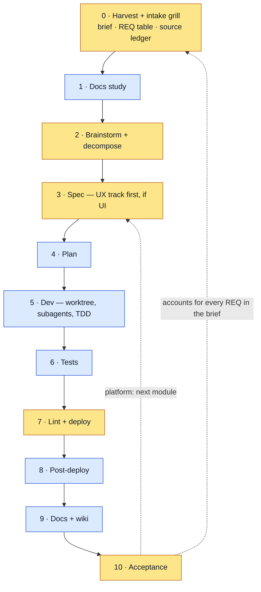

# task-pipeline

[](https://www.npmjs.com/package/task-pipeline-skill)
[](https://github.com/ssheleg/task-pipeline/actions/workflows/validate.yml)
[](LICENSE)

**A full-cycle delivery pipeline for coding agents.** One skill takes a substantial
task, interrogates it into a complete brief, then walks it through ten gated stages
— and refuses to advance until each gate passes.

Agents write code well and judge *when to stop asking you things* badly. A
substantial task becomes twenty interruptions, or a confident build that skipped
the tests and quietly delivered two thirds of what you asked for. `task-pipeline`
front-loads every decision into one intake conversation, then runs to the end
without checking in — and closes by accounting for every requirement, from a list
rather than from memory.

Built for **Claude Code**, and installable into any agent that reads skills
(Cursor, Codex, OpenCode, …). Every stage's doctrine ships **inside the skill** —
no companion plugin, nothing to resolve, nothing that breaks when a dependency is
missing.

---

## The flow

```
intake grill → docs study → brainstorm + decompose → spec → plan → subagent build
→ tests → lint/deploy → post-deploy log check → docs/wiki sync → acceptance
```



Every gate is **typed**: `auto` — the orchestrator verifies it itself, pass/fail
(blue); `manual` — it waits for your explicit go (amber).

| # | Stage | Gate | Type |
|---|---|---|---|
| 0 | Harvest + intake grill — **mandatory** | source ledger written; the documentation inventory answered into `docs/DOCMAP.md`; intent reconciled against as-built; shared understanding + autonomy sweep; brief locked | manual |
| 1 | Docs study | contracts grounded on current docs | auto |
| 2 | Brainstorm + decompose | design approved; UI verdict recorded; every REQ answered; platform: module map approved | manual |
| 3 | Spec | committed + reviewed; UI: super-ux chain validated, linter green | manual |
| 4 | Plan | parallel-ready, DoD per task | auto |
| 5 | Dev | tasks DONE (three review verdicts each), TDD green per task | auto |
| 6 | Tests | full suite green, new code covered | auto |
| 7 | Lint + deploy | lint clean + suite green before deploy | manual |
| 8 | Post-deploy | clean boot / honest degradation | auto |
| 9 | Docs + wiki | the propagation matrix walked and the documentation gate green with its ratchets printed; every stale source-ledger row updated; docs + wiki synced; the code graph refreshed and checked against the docs | auto |
| 10 | **Acceptance** | every REQ accounted for with evidence; every check leaned on seen failing once; operator signs off; the retro written — pruned before anything was added, every lesson carrying its commit | manual |

## What you get

- **The intake grill asks what a senior engineer would ask** before anything is
  touched — scope, edge cases, failure modes, rollback, who the user is — so the
  build does not stall halfway through.
- **Every stage has a gate.** No code before a spec. No deploy before tests. No
  "done" before the post-deploy logs have been read.
- **Nothing falls out the back.** The request becomes a frozen, addressable list of
  requirements, and the last stage accounts for every one with evidence — then
  walks the ladder for what should have been on the list and never was.
- **Team discipline without a team.** ADRs, a written plan, a real test suite, a
  wiki entry — produced as part of the work, not promised for later.
- **It adapts to your repo, not the reverse.** Deploy, docs and wiki conventions
  are read from the host project, so nothing is imposed.
- **It gets better at your project, without getting longer.** Each run ends with a
  retrospective, and the next run reads it — but the standing-instruction list is
  capped at ten and pruned *before* anything is added, so what you inherit is the
  rules that still fire, not an archive.

## Quickstart

```
/plugin marketplace add ssheleg/task-pipeline
/plugin install task-pipeline@task-pipeline
```

Then say *"run this through the pipeline"*, *"the full cycle"*, or invoke
`/task-pipeline <one-line task>`. Russian phrasings (*"полный цикл"*, *"прогони по
конвейеру"*) route the same way. The skill creates a TaskList with one entry per
stage and walks the gates. See [Install](#install) for the other channels.

---

## What makes it different

### Everything is built in — zero required dependencies

The doctrine each stage runs on ships inside the skill. Nothing to install for it,
nothing to resolve at preflight, no version skew with someone else's repo, and
**no stage blocks on an install** — stage 1 falls back to web search, the wiki and
the code graph are recommendations. The one exception is deliberate and named: on a
user-facing task the stage-3 UX track requires super-ux, and the spec gate stops
until it is installed.

| Stage | Built-in doctrine |
|---|---|
| 0 Knowledge harvest | [`knowledge-sources.md`](plugins/task-pipeline/skills/task-pipeline/references/knowledge-sources.md) — source list, the wiki, the ledger, the stage-9 loop-back |
| 0 Intake grill | [`grill.md`](plugins/task-pipeline/skills/task-pipeline/references/grill.md) — interview loop, domain awareness, autonomy sweep |
| 2 Brainstorm | [`brainstorm.md`](plugins/task-pipeline/skills/task-pipeline/references/brainstorm.md) — approaches, YAGNI, the no-code-before-approval gate |
| 2 Decompose | [`decomposition.md`](plugins/task-pipeline/skills/task-pipeline/references/decomposition.md) — platforms only: brick criteria, module map, build order |
| 3 Spec | [`spec.md`](plugins/task-pipeline/skills/task-pipeline/references/spec.md) — UX-track order, locked contracts, global constraints, self-review |
| 4 Plan | [`planning.md`](plugins/task-pipeline/skills/task-pipeline/references/planning.md) — zero-context tasks, parallel groups, no placeholders |
| 5 Build | [`build.md`](plugins/task-pipeline/skills/task-pipeline/references/build.md) + [`review.md`](plugins/task-pipeline/skills/task-pipeline/references/review.md) — isolation, ledger, subagent loop, review rubric, fix loop |
| 5–6 TDD | [`tdd.md`](plugins/task-pipeline/skills/task-pipeline/references/tdd.md) — the iron law, red/green/refactor, the suite gate |
| 10 Acceptance | [`acceptance.md`](plugins/task-pipeline/skills/task-pipeline/references/acceptance.md) — REQ coverage table, evidence rules, the closing question |
| 10 + any audit | [`audit.md`](plugins/task-pipeline/skills/task-pipeline/references/audit.md) — the L0→L7 ladder and its seams, axis rotation, ratchets, proven checks |
| any loop | [`loop-guard.md`](plugins/task-pipeline/skills/task-pipeline/references/loop-guard.md) — churn detection, caps, the break protocol |
| run-wide pacing | [`continuity.md`](plugins/task-pipeline/skills/task-pipeline/references/continuity.md) — the loop mode (`run.loop`, default off, never collapses a manual gate) and the context budget (fires on a harness signal, never on an estimate) |
| 0 + 9 + any settled decision | [`documentation.md`](plugins/task-pipeline/skills/task-pipeline/references/documentation.md) — the inventory, registers and ids, SSOT, the Doc Loop, supersede semantics, the propagation matrix, intent vs as-built |
| 3 + 4 · every spec and plan | the self-review reads its rules back — is every named check real, does anything contradict a locked decision or a rejected option, and what does this cost now versus at design time. Answers land as a committed `## Self-review` of computed numbers |
| 6–10 + any check you write | [`gates.md`](plugins/task-pipeline/skills/task-pipeline/references/gates.md) — the two axes, the promotion ladder, gate anatomy, the probe recipe, ratchet floors |
| any agent-time enforcement | [`hooks.md`](plugins/task-pipeline/skills/task-pipeline/references/hooks.md) — the `PreToolUse` contract, the fail-open hazard, the Claude-Code-only limit |

**Ported, not depended on.** Stage 0 is adapted from
[Matt Pocock's `grilling` / `grill-with-docs`](https://github.com/mattpocock/skills)
and stages 2–6 from the corresponding skills in
[obra/superpowers](https://github.com/obra/superpowers) — both MIT, both credited in
[LICENSE](LICENSE) → *Third-party*. Nothing at runtime reaches for either.

**Optional bridge:** if you already run an equivalent skill set, map it onto stages
2/4/5/6 in your `pipeline.json` → `skills[]`. That's a substitution, never a
requirement — the gates still govern, and nothing detects, recommends or waits for
an external provider.

### The intake grill (stage 0) — mandatory

Before any technical work, task-pipeline interviews you relentlessly — one question
per turn, each with a recommended answer, exploring the codebase before asking —
until every decision branch is resolved and locked into a **task brief**. There is
no "clear enough task" exemption: no stage-1 work starts without a committed,
confirmed brief.

**Domain awareness.** While exploring, the grill reads the project's own
`CONTEXT.md` / `docs/adr/` and holds you to them — calling out terms that conflict
with the glossary, replacing overloaded words with a canonical one, stress-testing
relationships against concrete edge cases, and surfacing where the code contradicts
what you just said. Resolved terms are written into `CONTEXT.md` as they land;
decisions that are hard to reverse, surprising without context **and** the result of
a real trade-off get an ADR. Both files are created lazily.

**Autonomy comes from the sweep.** Beyond the task itself, the grill pre-resolves
everything that would otherwise interrupt stages 1→10: which external libs need
docs, branch and task-tracker policy, the test command and what "green" means, the
lint command, the deploy target and its **authorization**, where logs and health
live, which docs and runbooks to update, and the model. Each gets an answer or an
explicit "stop and ask me here" — an unasked question is a scheduled interruption.
Deploy authorization has a hard floor: a standing go counts only if it names the
target and the preconditions.

### Knowledge harvest — read the project before asking the person

Stage 0 doesn't open with a question. It opens by finding what the project already
knows about this task
([`knowledge-sources.md`](plugins/task-pipeline/skills/task-pipeline/references/knowledge-sources.md)):
the code, `CLAUDE.md`, `CONTEXT.md` and the ADRs, `docs/` and `docs/ux/`, previous
pipeline briefs and their carry-over ledgers, **the retro's standing instructions**
(read in full — they bind the run; see below), **the knowledge wiki if you have one**,
and **any other repository or hosted doc system your project names as its docs**. It's
retrieval scoped by the task's own nouns, not a read of everything, and it ends with a
**source ledger** written into the brief — one row per source, what it says, how
fresh, and whether this run makes it stale.

That buys two things. The cheap one: you don't get asked what an ADR already
answers. The one that matters: **an answer nobody can check is a recollection.**
People answer from memory about systems they wrote a year ago, and without the
document in hand there is no way to tell a decision from a misremembering — so the
run builds on it and every later gate passes honestly on a false premise. With the
harvest in hand the grill quotes the source instead: *"the March ADR says orders go
through the command handler, you just described a direct write — has that changed?"*
You outrank every document, but **only out loud**: an override quoted against its
source is a recorded decision, an unquoted one is an undetected divergence. When two
sources disagree, precedence is code > host docs/ADRs > wiki > memory.

Then the loop closes: **stage 9 updates exactly what stage 0 read.** Every doc the
run proved stale is already in the ledger with what's wrong, so "docs updated" means
the sources the next run will trust — not just the files this change happened to
touch.

**The wiki is [obsidian-wiki](https://github.com/ar9av/obsidian-wiki)** (Karpathy's
LLM-wiki pattern), and it's the one source that carries *why* across projects and
across months. Detected via `~/.obsidian-wiki/config` or a resolving `wiki-query`.
Installed → queried at stage 0, synced with `wiki-update` at stage 9. Not installed →
recommended once, with the line, and the run continues:

```bash
pip install obsidian-wiki
obsidian-wiki setup --vault /path/to/your/vault
```

It is a **recommendation, never a gate** — no stage blocks on a missing wiki, and
nothing asks twice in one run.

### The code graph — reach, and a second opinion on your docs

A grep finds a **name**. A graph finds **reach**: what actually calls this, what
breaks if it moves, what every change passes through. That is the question stage 0
needs answered before it asks you anything, and the one documents answer least
reliably — a document records the reach its author remembered.

So where a code graph exists, the pipeline uses it
([`knowledge-graph.md`](plugins/task-pipeline/skills/task-pipeline/references/knowledge-graph.md)).
The tool is **[graphify](https://github.com/Graphify-Labs/graphify)**; detected via
`graphify-out/graph.json`. Not installed → recommended once, in the preflight block,
with the lines — then the run continues:

```bash
uv tool install graphifyy      # the CLI
graphify install               # add the /graphify skill to this agent
```

then, in the project root:

```
/graphify .
```

**Stage 0 asks it what grep can't** — `graphify query "how does session reach the
API layer"`, `graphify affected "AuthModule"`, `graphify god-nodes` — and records it
in the source ledger **with its measured lag**, because a graph goes stale exactly
like a doc. Not a build date: `built 2026-08-05` is the graph's own reply about
itself, true and self-reported and silent about whether it describes the tree you
are about to change. The row carries `N commits / M days behind HEAD`, the signal
that measured it — and, on anything but `current`, `⚠ not trusted for reach until
refreshed`. It points; the code decides.

**Stage 9 closes three artifacts, not two.** Docs, wiki, **and the graph** — in the
agent, so the documents this stage just edited are re-extracted too:

```
/graphify . --update
```

There is a CLI shortcut, `graphify update .`, which is structural, model-free and
**code-only** — the wrong default at the one stage whose job was changing the docs,
because it produces the most expensive kind of stale graph: one that was refreshed.
And the reason the graph is a peer of the docs rather than an afterthought: the
*next* run's harvest queries it first, so a stale graph is a false premise delivered
with the authority of a machine. A wrong doc gets argued with. A wrong graph gets
believed.

**Then the divergence check — two independent statements of the same system.** This
is the part a doc linter cannot do, because it compares your docs against the code's
actual shape rather than against itself:

| Ask the graph | A disagreement means |
|---|---|
| `graphify god-nodes` | a hub **no document names** — an undocumented seam: the thing every change passes through and nothing explains |
| `graphify path "A" "B"` | an edge the docs **deny** — either a leak in the code or a lie in the docs, and which one is a decision, not a guess |
| `graphify affected "X"` | callers the docs never mention — the documented blast radius is smaller than the real one |
| a doc naming a module the graph has **no node for** | the doc describes something that no longer exists |

Doc-side findings are fixed at stage 9. Absences go to stage 10's ladder walk and
become **REQ rows with their checks** — the graph is the fourth audit axis, and the
only one that finds an absence without reading for it. The graph is *derived*, so it
is never hand-edited and `graphify-out/` is git-ignored by default: you fix the code
or the doc and re-extract.

Cadence: refresh every close-out, sweep periodically (stage 10, or when another axis
goes quiet). Like the wiki, it is a **recommendation, never a gate**.

### The REQ spine — why nothing falls out the back

Every gate before the last one asks *"is this artifact good?"* — none asks *"does
this still contain everything that was asked for?"* Scope doesn't leak inside a
stage; it leaks on the **seams**, because brief → spec → plan → task briefs is four
rewrites and nothing compares the lists.

So the grill's second hard output is an addressable **requirement table**: one row
per independently verifiable deliverable, each naming how it will be verified. A
requirement you can't say how to verify is a badly-stated requirement — it gets
split during the grill, not discovered at the end.

From there the ids thread through everything:

| Where | What it does |
|---|---|
| Spec | every section carries `covers: REQ-…` |
| Plan | every task carries `Implements: REQ-…`; **the gate is set equality** against the brief — a difference is printed as the explicit list of dropped requirements |
| Build | the implementer's brief quotes the REQ statement verbatim, so it optimises the requirement and not just the instruction |
| Review | a third verdict beside spec-compliance and code-quality: **does this satisfy its REQ?** |
| Deploy | no REQ may still be `open`; a `partial` ships only with explicit acceptance |
| **Acceptance** | every REQ gets `verified` / `partial` / `deferred` / `dropped` — and `verified` requires **evidence**: a passing test name, a `file:line`, a command and its output |

Two rules keep it honest. **The list is frozen** — adding mid-run is free, removing
or narrowing needs your explicit agreement, because silently restating the task
smaller makes every later gate pass honestly on a shrunken task. And **deferred out
loud is forgotten** — anything postponed, dropped or half-done goes into an
append-only carry-over ledger the moment it's said, including implementer concerns
and non-blocking review findings.

Stage 10 closes the circle with the question the pipeline exists to be able to
answer from a list rather than from memory: *here's what you asked for, here's what
shipped, here's what's deferred and where it lives — what's missing?*

### Platforms — decomposed into bricks, built one at a time

A one-feature task runs the pipeline once. A **platform** — several independent
capabilities, several separately shippable surfaces, requirements no single
deliverable satisfies — gets cut into modules at stage 2, before any spec is
written ([`decomposition.md`](plugins/task-pipeline/skills/task-pipeline/references/decomposition.md)).

Modules are cut **by capability, never by layer** ("Ordering", "Billing" — not
"Controllers", "Services"), and a candidate is only a brick when it is
independently specifiable, buildable and testable, owns its own entities, talks to
its neighbours through declared contracts only, and can land while leaving the
system working. The committed module map fixes the build order — **walking skeleton
first**, then topological, no cycles — and every requirement maps to exactly one
module.

Then stages 3→10 run **per module**: dossier → plan → build → tests → deploy →
post-deploy → docs → acceptance → next brick. Stages 0–2 run once for the platform,
and the map's status column is what a resumed session reads to know where it
stopped. Each module's spec is a full dossier: architecture, entities and
ownership, contracts in and out with their failure behavior, business rules, edge
and failure cases, UI/Figma chain, limits, open questions.

### Loop guard — churn is detected, not endured

Any repeating pass can start undoing the previous one: two shapes alternating, the
same file rewritten round after round, a finding that was closed coming back. That
looks like progress and consumes a run, so it is
[detected mechanically](plugins/task-pipeline/skills/task-pipeline/references/loop-guard.md):
every repeat pass logs one line per touched file with **the reason that forced it**
— a finding id, a failed gate item. "Cleanup" is not a reason.

It trips on revert-oscillation, a file edited twice for the same reason, a
resurrected finding, a third entry into one stage, or two loops editing one file —
plus hard caps (5 fix rounds per task, 2 re-entries per stage, 3 passes per module).
On a trip the run **stops editing**, names shape A and shape B with their evidence,
escalates to the layer that owns the conflict (rubric → operator → plan → spec →
module map), re-plans the check as an ordered checklist with one verification
command per item, and goes through it one at a time. A higher-layer conflict is
never settled inside a lower loop.

### The audit ladder — finding what was never written

The REQ spine catches a requirement that was **named and lost**. It cannot catch
one that was never named — because **a comparison needs two sides, and an absence
has one.** Nothing in a diff between spec and plan reveals the error path nobody
specified, the entity nobody gave an owner, the failure mode nobody thought of.

So stage 10 opens with a **ladder walk**
([`audit.md`](plugins/task-pipeline/skills/task-pipeline/references/audit.md)), not
with the coverage table. Each requirement is walked **bottom-up** through its rungs
— recorded decision → spec section → contract *and its failure behavior* → plan
task → the change in the tree → an **executed** named assertion → the surface a
user reaches and its docs — and the work is the **seam between each pair**: did the
decision reach the spec, does every contract have a task, did the DoD land in the
diff, would that test still pass with the production code deleted, does what
shipped satisfy the requirement's own *statement* rather than the task's
instructions. Findings are ordered **by seam, never by file** — the seam names
which layer of your process leaks. Every absence becomes a new REQ row with its
check *before* the table is written.

Bottom-up is not taste: a missing artefact low on the ladder makes everything above
it meaningless, so top-down you spend the pass polishing a surface for a contract
that does not exist.

**The frame is a rung too, where the project designs visually.** super-ux owns the
frame completely — the Figma on/off choice, the MCP preflight, the
`SCR-NN/<Screen>/<state>` naming, and a linter that catches a missing, misnamed or
stale link. What no linter can check is **what the frame says.** A link can be
present, correctly named and fresh while the picture behind it promises a retention
window, a credit meter or a pricing tier the spec never described and the code
never built — a rendered claim about the product, seen by more people than the
spec, and often the version stakeholders believe. Compare frames to frames and they
agree; compare specs to specs and they agree; the defect lives in the seam. So the
walk adds two questions on UI work: *does the frame render what the spec says*, and
*does what shipped still match the frame*. The spec is the contract — say which
document you propose to move, and remember that **editing a shared design file is
outward**, like a PR or a deploy.

Three rules keep the audit from becoming another loop:

- **Every pass changes the axis, not the effort.** A searching pass doesn't
  oscillate, it *converges*: each pass edits the corpus the next one reads, so the
  newest edits are always the least-reviewed text and are what the next pass finds.
  Measured over seven passes on a production repository, by pass six the audit was
  mostly repairing its own previous pass — while the finding count still looked
  healthy. So count both numbers every pass (new findings vs. self-inflicted ones);
  when the second overtakes the first, **rotate the axis** — seams down one
  deliverable, then invariants across deliverables, then one class swept end to end.
- **A class that repeats twice becomes a gate, not a note.** Once is an incident;
  twice is a category, and a category belongs in lint or CI where nobody has to
  remember it. The third instance in a ledger is how a mechanical defect becomes
  permanent.
- **What can't be fixed now becomes a ratchet, never a TODO** — a named, counted
  set that may only shrink, printed *beside every gate verdict*
  (`carry-over: 4 open (was 6) · unresolved: 0`). A TODO is invisible until someone
  opens the file; a ratchet makes **"green" never read as "verified"** — it reads
  as *"green, and here is exactly what was not looked at"*.

And the exit criterion that is usually skipped: a deliverable is audited when every
rung has its artefact **and every check you are relying on has been seen failing
once against a planted defect.** That is the TDD iron law — *if you didn't watch it
fail, you don't know it tests the right thing* — raised from one test to every
gate, linter and script in the run. **A green result from an unproven check is
worth nothing.**

### Documentation is a deliverable, and it has a gate

Stage 9 used to say *"docs in sync with code"*. That sentence names no artefact and
no command, so nothing could make it false. The pipeline now carries the system that
can.

**Stage 0 answers four questions** and writes them to `docs/DOCMAP.md`: where
settled things live, what each fact's single home is, what a change of type X
obliges, and what proves it. A project with no answers gets them seeded — a decision
register, an open-questions register and a portable documentation gate — and the
seeding is itself the register's first entry. One decision home per project: an
existing `docs/adr/` **is** the register and is never duplicated.

**The Doc Loop fires whenever anything is settled, at any stage.** Reserve the id,
record it, resolve the question it answers, propagate, commit with the ids. A
decision that lives only in the spec dies with the spec; one that lives only in the
conversation was never made.

**The propagation matrix is not the harvest ledger.** The ledger names the documents
the run *read*; the matrix names the documents it *owes*. They are different lists,
and the gap between them is where documentation rots — the document nobody read is
exactly the document nobody updated.

**Governance is a by-product, not a second job.** The run already produces decisions
(the brief's *Decisions locked*, the spec's contracts, the ADRs), so recording one is
transcription plus a stable id. And the seeded gate **arms progressively**: a section
whose input does not exist yet prints `dormant` and stays green, so a three-file
repository is governed from day one without starting red — a scaffold that seeds red
teaches everyone on day one that the gate is noise.

### Gates and hooks — how a rule becomes something that can say no

Two axes, deliberately not conflated. **The stage gate type** (`auto` = verify it
yourself; `manual` = wait for an explicit go) is about this pipeline. **The
enforcement mechanism** is a ladder a rule climbs: a doctrine line → a review
question → a script check (promote here once the class has occurred *twice*) → a CI
step → a hook. A rule may sit on several rungs; what it may never do is *pretend* to
be on a higher one.

The skill ships the anatomy of a gate that cannot lie — non-zero exit on any
failure, the verdict block last with nothing after it, a scope header saying what it
does **not** cover, ratchet floors as variables with the counts printed beside `OK`,
skips printed rather than silent, and every count computed rather than restated —
plus the probe recipe, because a green from a check nobody has watched fail is worth
nothing, and **the probe is the thing to doubt first**.

Hooks get their own file, and it leads with the limit: they exist only in Claude
Code, and **any exit code other than 2 is non-blocking, so a crashing guard fails
open** and stops guarding without announcing it. Elsewhere the run is `ungated` and
must say so.

### Held to Anthropic's own Skill authoring guidance

Audited against the four Agent Skills pages. Most of it already held — `name`
13/64 chars, `description` inside 1024, `SKILL.md` 334/500 lines, all 23 references
linked **directly** from `SKILL.md`, 436 KB against a 30 MB ceiling. What did not,
now does:

- **Every reference over 100 lines carries a `## Contents` list**, and the list is
  *compared against the file's own headings* rather than trusted. The guidance is
  explicit about why: a long file gets previewed with a partial read, and
  `stages.md` is 500 lines.
- **A behavioural evaluation suite** (`evals/`) — 13 evaluations across the five
  dimensions the enterprise guidance names: should-trigger, should-not-trigger,
  ambiguous, coexistence, instruction-following. `evals/run.py` validates the suite
  and prints the protocol; it **never reports a pass**, because no runner exists
  upstream and a script claiming to have run a model would be the exact failure this
  skill is written against. `evals/RESULTS.md` carries the honest state.
- **A copyable run checklist** and a **stated degree of freedom per stage** — high
  in the open field (brainstorm), low on the narrow bridge (TDD order, deploy, the
  matrix walk).
- **[`SKILL-CARD.md`](SKILL-CARD.md)** — the registry entry an enterprise reviewer
  needs, with an honest pass over the risk-tier table. This skill scores three
  *High* indicators and says so, along with what a consumer should know rather than
  discover: author and reviewer are the same person, commits are unsigned, and the
  eval suite has not been executed.

### The entry audit — before the feature, not after

`/task-pipeline setup` runs seven passes over the documentation a project already
has, and hands back a fix plan rather than a lecture: one decision home, register
integrity, ratcheted propagation, the matrix's *Checked by* column, declared terms,
the UX chain, and the gate itself proven against a planted defect. Findings carry
`file:line`, the minimal fix and **the seam** — ordered by seam, because that names
which layer of your process is leaking.

Offered once when the doc map is absent or stale, and the refusal is recorded. It
also runs the **inward check**: does this project hold a rule that would be true in a
repository nobody has seen? If it names no path, no command and no person, it is the
bundle's — and keeping it local costs every future project
([`references/portability.md`](plugins/task-pipeline/skills/task-pipeline/references/portability.md)).

### Adopting it — a new project, and the one you actually have

Greenfield is mechanical: stage 0 seeds `docs/DOCMAP.md`, the registers and the gate
before the first interview question, and the gate is green on day one because
sections with nothing to check yet print `dormant`.

Brownfield is a different problem, and [`references/adoption.md`](plugins/task-pipeline/skills/task-pipeline/references/adoption.md)
gives it seven steps. The third one decides whether adoption survives: **baseline the
ratchets at today** — the propagation floor to the next free id, the residue floor to
the measured count — so the gate is green on the history it inherited and red only on
what happens next. On the project this practice comes from, that check's first run
reported 162 missing propagations across 73 decisions. That is a printed number, not
a to-do list; a gate that is red on adoption day is switched off on day two.

And history is **not** back-filled. An old decision enters the register the day
somebody is about to contradict it — when the reason is being discussed anyway and
the person who holds the context is in the room.

### The retrospective — the run teaches the next run, and the list stays short

Every gate in this flow is good at *this* run and blind across runs. So the same
class of failure gets caught, fixed and forgotten five times, and nothing in the
pipeline notices it is the same one.

The last act of stage 10 is therefore a **retrospective**, written to
`docs/superpowers/retro.md` — **one file per project, not per run**
([`retrospective.md`](plugins/task-pipeline/skills/task-pipeline/references/retrospective.md)).
Every run **prunes and stamps**; only a run that *diverged* writes an entry:
symptom with evidence, the stage it surfaced at, the stage that **owned** it, the
root cause, the fix, and the check that catches it the first time from now on.

**Fixes come in three grades, and you take the highest one that works:**

| Grade | What it is | What it costs later |
|---|---|---|
| 1 — mechanical | a test, a lint rule, a gate criterion, a hook | nothing: the check *is* the memory |
| 2 — standing instruction | a rule agents read, for what no check can decide | one of ten slots, and its retirement trigger must be written at birth |
| 3 — a note | something still being understood | expires in two runs, then it is promoted or deleted |

**The prune is mandatory and runs before anything is added.** Every standing
instruction is checked against three retirement triggers — *it became a check* ·
*every path or command it names is gone* · *it has not fired in the last five run
stamps* — and the list is held to a **hard cap of ten**. At eleven, the oldest
never-fired rule goes; "but they all matter" is exactly the state in which the list
stopped being read, and the ninth stale rule is what discredits the two that are
load-bearing.

Nothing is deleted silently: **every retirement writes one line in the log**, so
the incident survives and only the instruction leaves. And the counts print beside
the gate verdict, like the carry-over ledger's, so a list that quietly grew back is
visible where it happened:

```
GATE 10 acceptance: PASS — 14/14 REQ verified
  carry-over: 0 unresolved · retro: 7 standing (was 9) · retired 3 · added 1
```

Stage 0 reads those standing instructions **in full** on the next run — which is
the whole reason the cap exists and the prune is a gate criterion instead of a good
intention. A rule nobody reads to the end is worse than no rule: everyone believes
it is covered.

### UX track (user-facing tasks) — super-ux recommended

The moment a task touches any user-facing surface (web / mobile / CLI / TUI — a
screen, command, or visible behavior), [super-ux](https://github.com/ssheleg/super-ux)
is the **recommended** workflow, detected early in the stage-0 grill. If it's
installed, task-pipeline uses it; if not, it gives you the install line on the spot.
The spec stage runs it **before any plan is written**: `/ux` (setup check) →
`ux-foundation` (personas, JTBD, **customer journey maps**, user stories) →
`ux-flows` (user flows + `screens.md` UI map, Figma frames) → `ux-scenarios`
(usage scenarios validated against super-ux's own scenario-format contract) →
`/ux-lint` (must pass). The spec then embeds the UX layer — scenario IDs, CJM
stages served, applicable UX patterns — and the plan's UI tasks carry scenario IDs
in their DoD. Scenarios come before interface.

```
/plugin marketplace add ssheleg/super-ux
/plugin install super-ux@super-ux
```

**Figma is super-ux's, and the decision about it is stage 0's.** super-ux mirrors
every `SCR-` screen and state into a frame when the project designs visually, and
it handles all of it: the on/off choice, the MCP preflight, the naming contract,
the drift linter. task-pipeline only settles the part that would otherwise
interrupt a run — *is Figma on, is the MCP connected, and if it isn't, do we ship
text-only or stop and connect it?* That last clause matters: super-ux recommends
the MCP and then **continues text-only on its own, never blocking**, so an unasked
question quietly narrows the delivery from "designed" to "described". The stage-0
sweep decides it, and the preflight block flags the missing MCP in the same
exchange as everything else.

**One file, in a named team, decided before anything is drawn.** Left to drawing
time, "where do I put this?" gets answered by whichever agent is holding the brush,
and the answer is usually *create a new file* — which is how a project acquires
three files called some variation of "Design", each with real work in it. So the
sweep settles the **team or organization by name** (a file URL says which file, not
whose workspace — a design that lands in someone's personal drafts is invisible to
everyone who needs it) and **the file**: the one already recorded, a URL you supply,
or creation in that named team, explicitly authorized the same way a deploy target
is. Two rules make it stick: **never create while a recorded file resolves**, and
**if the recorded file doesn't resolve, stop and ask — never create a replacement**,
because "I couldn't open it so I made a new one" is both the duplicate and a hidden
permissions problem. The URL is written to the project's canonical record —
`docs/ux/foundation.md` → *Design tooling*, or the repo's own docs when there's no
UX chain — **before the first frame**, and the audit's `F` rung then checks it
mechanically: every `screens.md` deep link is `figma.com/design/:fileKey/…`, so a
key that differs from the recorded one is a second file, caught by a string match.

### Model policy — one model, confirmed once

The default recommendation is *the most capable reasoning model the environment
offers* — currently the latest Opus generation, but that's a **tier, not a string**.
Model ids go stale as generations ship, and you may be on another provider entirely,
so nothing is hardcoded: the pipeline resolves the top tier available at runtime and
stage configs use provider-agnostic tokens (`default` / `inherit`).

You confirm or override it (per-stage overrides welcome) before stage 0 — then it
**stops asking**. A skill can't switch the main-loop model; `/model` is yours.
Stage-5 subagents are pinned to the confirmed model automatically. If the
recommended tier isn't available, the pipeline says which one it's using and
continues — a reminder, never a block.

---

## Configure it for your project

### Bring your own skills

Stages 0→10 above are the plugin's **example** flow. It is a machine-readable config
([`pipeline.example.json`](plugins/task-pipeline/skills/task-pipeline/pipeline.example.json))
written against a universal contract
([`pipeline.schema.json`](plugins/task-pipeline/skills/task-pipeline/pipeline.schema.json)):
copy the example to `pipeline.json` in your repo and rewrite it with your own stages
(any count), your own `skills[]`, and your own `auto`/`manual` gate types. The
framework bakes in no fixed stage count and no opinion on which gates are manual.

```jsonc
{
  "version": 1,
  "stages": [
    {
      "id": 1,
      "state": "spec",
      "name": "Spec",
      "model": "default",              // 'default' = the run's confirmed model
      "skills": ["your-team:spec"],    // whatever your environment resolves
      "gate": { "type": "manual", "check": "spec committed and reviewed" }
    }
  ]
}
```

### Release automation (optional, toggleable)

A pipeline config may declare an optional `release` block: a master `enabled`
toggle, a `trigger`, project-defined `steps`, and `verify` smoke-checks. It's **off
unless a project turns it on**, and every project configures its own. This repo's
own instance is [`.github/workflows/release.yml`](https://github.com/ssheleg/task-pipeline/blob/main/.github/workflows/release.yml) —
armed per repo by the `RELEASE_ENABLED` variable (unset = off), it validates the tag
against the manifests, cuts a GitHub release from the CHANGELOG, and smoke-tests
`npx` from a clean checkout. Copy and adapt it; nothing is hardcoded.

### Portability

Stages 6–10 read the host project's `CLAUDE.md` conventions (tests / lint / deploy /
docs / wiki) with detection fallbacks, so the skill works in any repo. The canonical
artifact layout each stage writes to is fixed in
[`artifacts.md`](plugins/task-pipeline/skills/task-pipeline/references/artifacts.md).

---

## Install

**Claude Code plugin (recommended):**
```
/plugin marketplace add ssheleg/task-pipeline
/plugin install task-pipeline@task-pipeline
```

**Any agent via the skills CLI (Cursor, Codex, OpenCode, 70+ — not Claude Code,
use the plugin above):**
```bash
npx skills add ssheleg/task-pipeline --agent cursor --agent codex --global
```
(one repeated `--agent` per agent; never include `claude-code` while the plugin is
installed — the plain copy shadows it)

**npm installer (no clone needed):**
```bash
npx github:ssheleg/task-pipeline          # straight from GitHub
npx task-pipeline-skill                   # from the npm registry
```
(package is `task-pipeline-skill` — the unscoped `task-pipeline` name is taken
on npm; installs the same skill + `/task-pipeline` command into `~/.claude`,
idempotent, `--force` to overwrite)

**Cursor:** the skills CLI above with `--agent cursor`, or per project copy
[`cursor/rules/task-pipeline.mdc`](cursor/rules/task-pipeline.mdc) into the repo's
`.cursor/rules/`. Cursor has no global rules directory — use the skills CLI for a
global install, the `.mdc` for per-project, or paste it into Cursor Settings →
Rules. The rule is self-contained (no external links), so it works copied anywhere.

**Plain skill:**
```bash
git clone https://github.com/ssheleg/task-pipeline
cd task-pipeline && ./install.sh
```
(copies the skill into `~/.claude/skills/task-pipeline` and the `/task-pipeline`
command into `~/.claude/commands/`; idempotent — rerun skips existing installs,
`./install.sh --force` overwrites)

### Updating

**The family updates as one package** — a bundle with one member current and the rest stale is a
combination nobody tested:

```bash
npx sshlg-skills update               # installed but behind — updates everything
npx sshlg-skills install              # nothing installed yet
npx --yes sshlg-skills@latest list    # what the current release of each member is
```

Restart your agent afterwards: skills and hooks load at session start.

Per-channel, when you are updating this one member only:

Pick **one** channel per agent — running the plugin and the plain/skills-CLI copy on
the same Claude Code install yields a duplicate, shadowing skill.

| Agent / channel | Update |
|---|---|
| Claude Code (plugin) | `claude plugin marketplace update task-pipeline` → `claude plugin update task-pipeline@task-pipeline` → restart |
| Any agent (skills CLI) | `npx skills update task-pipeline --global --yes`; to add: repeated `--agent <name>` (never `claude-code` when the plugin is installed) |
| Cursor | skills CLI (above) with `--agent cursor`, or re-copy the `.mdc` per project |
| npm | `npx task-pipeline-skill@latest` / `npx github:ssheleg/task-pipeline` (ephemeral — always latest) |
| Plain skill | `git pull && ./install.sh --force` |

### Prerequisites

**None for the pipeline itself** — the doctrine for every stage ships inside the
skill. Four optional companions make individual stages better:

| Companion | For | Required? |
|---|---|---|
| [super-ux](https://github.com/ssheleg/super-ux) | the stage-3 UX track | only for user-facing tasks |
| context7 (MCP) | stage-1 docs study | recommended — web-search fallback |
| [obsidian-wiki](https://github.com/ar9av/obsidian-wiki) | stage-0 harvest + stage-9 sync | recommended — never a gate |
| [graphify](https://github.com/Graphify-Labs/graphify) | stage-0 reach queries + stage-9 refresh + the graph↔docs divergence check | recommended — never a gate |

A single preflight block prints which are ready, which to install, and the model
recommendation, so you arm the whole run in one exchange. Detail:
[`companion-skills.md`](plugins/task-pipeline/skills/task-pipeline/references/companion-skills.md).

---

## Documentation map

| File | What's in it |
|---|---|
| [`SKILL.md`](plugins/task-pipeline/skills/task-pipeline/SKILL.md) | the orchestrator: how to run, the stage table, the model decision |
| [`references/stages.md`](plugins/task-pipeline/skills/task-pipeline/references/stages.md) | per-stage detail and the exact gate criteria |
| [`references/artifacts.md`](plugins/task-pipeline/skills/task-pipeline/references/artifacts.md) | the canonical document layout each stage writes to |
| [`references/conventions.md`](plugins/task-pipeline/skills/task-pipeline/references/conventions.md) | how stages 6–10 read the host project's `CLAUDE.md`, and how the documentation regime is detected |
| [`references/documentation.md`](plugins/task-pipeline/skills/task-pipeline/references/documentation.md) | the doc system: the inventory, registers and ids, SSOT, the Doc Loop, supersede semantics, the propagation matrix, intent vs as-built |
| [`references/gates.md`](plugins/task-pipeline/skills/task-pipeline/references/gates.md) | the two axes, the promotion ladder, gate anatomy, the probe recipe, ratchet floors, where a gate runs |
| [`references/hooks.md`](plugins/task-pipeline/skills/task-pipeline/references/hooks.md) | the `PreToolUse` contract, the fail-open hazard, placement, and the Claude-Code-only limit |
| [`references/knowledge-graph.md`](plugins/task-pipeline/skills/task-pipeline/references/knowledge-graph.md) | the code graph: install line, stage-0 reach queries, the stage-9 refresh, the graph↔docs divergence check |
| [`references/retrospective.md`](plugins/task-pipeline/skills/task-pipeline/references/retrospective.md) | the project retro: the three grades of fix, the mandatory prune, the cap of ten |
| [`references/model-tiering.md`](plugins/task-pipeline/skills/task-pipeline/references/model-tiering.md) | model policy, the `/model` reminder, overrides |
| [`templates/`](plugins/task-pipeline/skills/task-pipeline/templates/README.md) | brief, carry-over ledger, `CONTEXT.md` and ADR skeletons, the doc map, both registers, the retro and its archive, the seeded `docgate.sh` and `hygiene.sh`, a worked hook |
| [`references/adoption.md`](plugins/task-pipeline/skills/task-pipeline/references/adoption.md) | the first run in a project: greenfield seeding, and the brownfield walkthrough |
| [`references/setup.md`](plugins/task-pipeline/skills/task-pipeline/references/setup.md) | the entry audit: seven passes over the docs a project already has, offered once, output as a fix plan |
| [`references/portability.md`](plugins/task-pipeline/skills/task-pipeline/references/portability.md) | the manifest of workflow decisions and their homes in the bundle, and the boundary against a project's own answers |
| [`references/learned.md`](plugins/task-pipeline/skills/task-pipeline/references/learned.md) | fifteen rules earned by failure on a real multi-repository build, each with its incident, its check and its exit criterion |
| [`SKILL-CARD.md`](SKILL-CARD.md) | the registry entry and risk-tier disclosure a reviewer needs before deploying it |
| [`evals/`](evals/RESULTS.md) | the behavioural evaluation suite, its protocol, and what has actually been observed |
| [`CHANGELOG.md`](CHANGELOG.md) | every release, with the reasoning behind it |
| [`CONTRIBUTING.md`](CONTRIBUTING.md) | dev setup, the validator, the version-sync rule, release flow |

## Contributing

Issues and pull requests are welcome — see [CONTRIBUTING.md](CONTRIBUTING.md) for
the repo's invariants (the structural validator, four-way version sync, and the
surfaces that must never drift apart). Security reports:
[SECURITY.md](SECURITY.md). Everyone participating is expected to follow the
[Code of Conduct](CODE_OF_CONDUCT.md).

```bash
npm test        # python3 test/validate.py — the structural validator
```

## Author

Built by ssheleg — [sshlg.me](https://sshlg.me)

- X / Twitter — [@sshlg93](https://x.com/sshlg93)
- Telegram — [@sshlg](https://t.me/sshlg)

Part of the [ssheleg skill family](https://github.com/ssheleg/sshlg-skills):
`super-ux`, `task-pipeline`, `agent-sync`, `make-skill`, `sheleg-design`, `seo-aeo-audit`.
**The family installs and updates as one package**, for every agent you use — a bundle with one
member current and the rest stale is a combination nobody tested:

```bash
npx sshlg-skills install              # nothing installed yet — the whole family, any agent
npx sshlg-skills update               # installed but behind — updates everything
npx --yes sshlg-skills@latest list    # what the current release of each member is
```

Restart your agent afterwards: skills and hooks load at session start, so the session that
updates is not the session that gets the new ones.

## License

MIT © 2026 ssheleg. Third-party portions (the ported stage doctrine) are credited
and licensed in [LICENSE](LICENSE) → *Third-party*.
